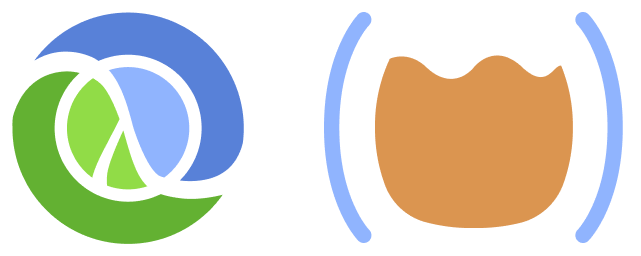

# Get Started with Clojure

A zero-install, interactve, guide to get you started with [Clojure](https://clojure.org/) using [Calva](https://calva.io/)'s **Getting Started REPL**.

## OK, but how?

Read about what this is here: [calva.io/get-started-with-clojure](https://calva.io/get-started-with-clojure/).

When you've read that, open [doc/INSTRUCTIONS.md](doc/INSTRUCTIONS.md)