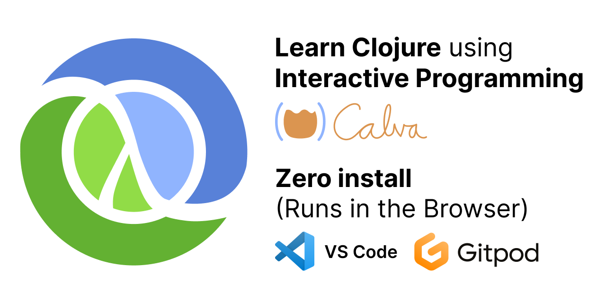
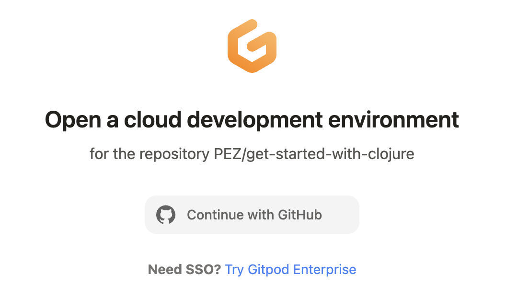
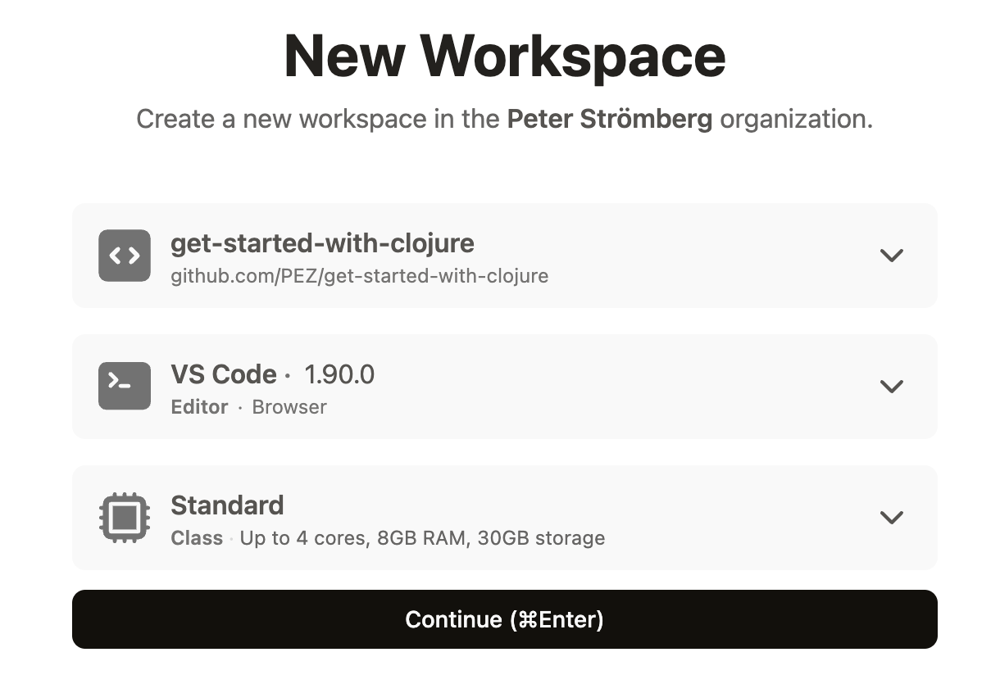

# Get Started with Clojure - Zero install

A zero-install, interactve, guide to get you started with [Clojure](https://clojure.org/) using [Calva](https://calva.io/)'s **Getting Started REPL**.

## OK, but how?

Start the Gitpod development environment by prepending the URL of this repository with:

`https://gitpod.io#`

If you are not using Safari you can also click this button:

If you are not signed in on Gitpod you should sign in with the GitHub option

Next, create the Workspace, the defaults will do.

Then it will take a while to pull Docker containers and stuff, but eventually VS Code will open in the browser and with [doc/INSTRUCTIONS.md](doc/INSTRUCTIONS.md) opened. Continue from there.

Happy Interactive Programming ❤️