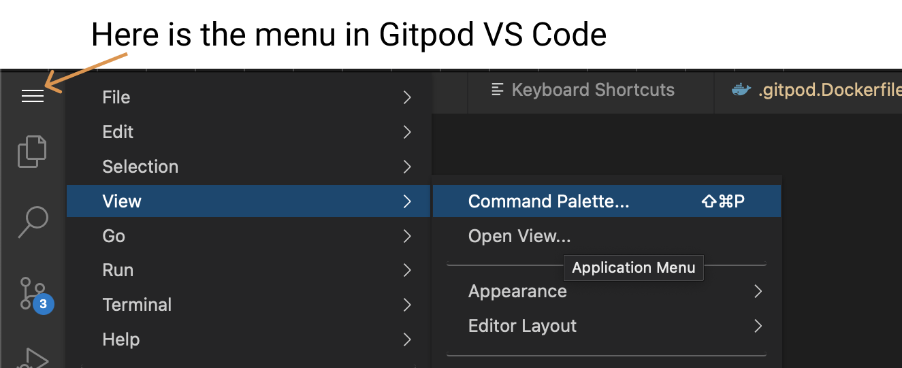
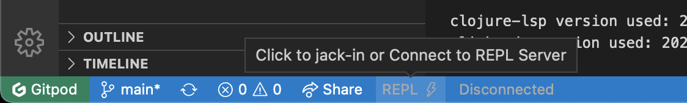
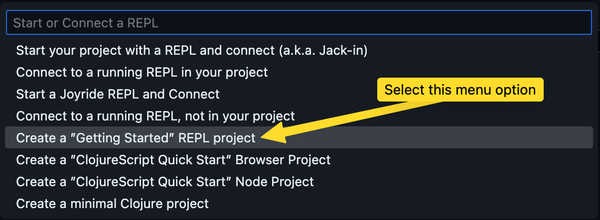
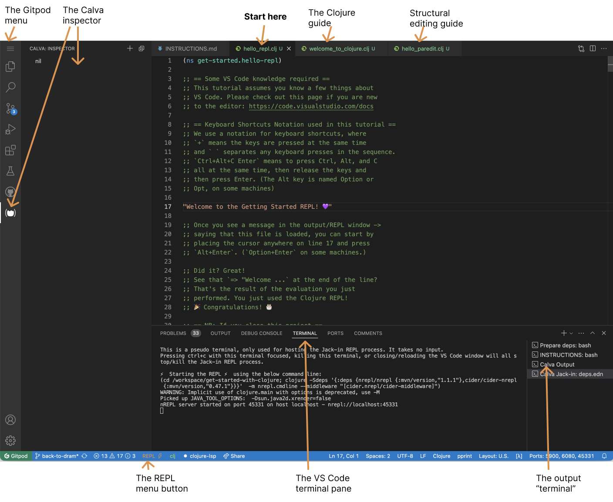

# How to use The Getting Started REPL

The Getting Started REPL connects Calva to three files, which will serve as your interactive guides:

1. `hello_repl.clj` – The basics of how to evaluate code in Calva (i.e. using the REPL)
2. `hello_paredit.clj` - A super brief intro to Calva structural editing ([Paredit](https://calva.io/paredit))
3. `welcome_to_clojure.clj` - The very basics of the Clojure language

The files contain a mix of guiding text and snippets of code. You will use the REPL to evaluate the code and sometimes you will be asked to write some code and evaluate it. And so on.

If you haven't already, you should start with reading [calva.io/get-started-with-clojure](https://calva.io/get-started-with-clojure/). 

I am new to VS Code

If you have never used VS Code before you might want to have a look at [this Getting Started with VS Code video](https://code.visualstudio.com/docs/introvideos/basics). (You can of course ignore the parts about installing for now.) Or at least have [this overview of the VS Code interface](https://code.visualstudio.com/docs/getstarted/userinterface) handy.

There are some difference between regular VS Code and Gitpod's ditto. We'll just help you find the main menu here:

## Let's go!

Fire up the Getting Started REPL:

0. Give the guides some space:
   * Maximize the browser window.
   * Close thee Explorer pane.
   * Shrink the Output/Terminal/Etc pane to about a third of what it is now.
1. Click the **REPL** button in the status bar

   
   
   

Don't see the REPL button?

    
    This could be because some firewall or adblocker prevents the downloading of the Calva extension. See [issue #9](https://github.com/PEZ/rich4clojure/issues/9) for more clues on this.
    
    

1. Select **Fire up the ”Getting Started” REPL** from the quick pick menu.

   

The files will open and the REPL will start. It can take a little while and different files will be active. When it is done it should look like so:

If the `hello_repl.clj` tab is not active when the Calva output window has printed that the file is loaded, then activate the tab.

If things seem to work (it looks like the picture shows) you can close the Problems/Output/Terminal area (resize it to zero), to make more room for the guide content. Both the VS Code Output and Terminal panes can contain messages that is needed when you think something has gone wrong and want to ask/report about it.

Happy Interactve Programming! 🎉

## Learn more

The guides are sprincled with URLs for the various topics brought up.

The Calva Documentation is here: [calva.io](https://calva.io/). 
