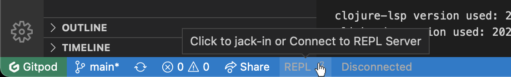

# How to use The Getting Started Project

The Getting Started Project consist of three Clojure files, which will serve as your interactive guides:

1. `hello_repl.clj` – The basics of how to evaluate code in Calva (i.e. using the REPL)
2. `hello_paredit.clj` - A super brief intro to Calva structural editing ([Paredit](https://calva.io/paredit))
3. `welcome_to_clojure.clj` - The very basics of the Clojure language

The files contain a mix of guiding text and snippets of code. You will use the REPL to evaluate the code and sometimes you will be asked to write some code and evaluate it. And so on.

## Let's go!

Fire up the Getting Started REPL:

0. Give the guides some space by maximizing the browser window
1. Click the **REPL** button in the status bar

   

   

Don't see the REPL button?

    This could be because some firewall or adblocker prevents the downloading of the Calva extension. See [issue #9](https://github.com/PEZ/rich4clojure/issues/9) for more clues on this.

    

1. Select **Create a ”Getting Started“ REPL project** from the quick pick menu.

   
1. You will be asked for a folder to create the project in. The current workspace root will work fine for this. *NB: The `./doc/` folder may be preselected.*

   

   
1. A new browser tab will open with the project files added, and the REPL will start and connect, when it is done it should look like so:

If the `hello_repl.clj` tab is not active when the Calva output window has printed that the file is loaded, then activate the tab.

### Evaluation results

If things seem to work (it looks like the picture shows) you can select the **Calva Output** “terminal” in the Terminal pane. (It's not a real terminal taking input, it's just where Calva is configured to print output).

Evaluation results will also be added to the **Calva Inspector**. Each entry has context buttons letting you *inspect*, *copy*, etcetera. The inspector is extra handy when something evaluates to a datastructure, like a list or a map.

That's it, please start with the instructions in `hello_repl.clj`.

Happy Interactive Programming! 🎉

## Learn and Practice Clojure using Rich 4Clojure

If you like the style of interactive learning that this guide provides, you should definitely check [Rich 4Clojure](https://github.com/PEZ/rich4clojure) out. It also can be used in the zero-installed way.

You can regard **Rich 4Clojure** as a companion to this guide. It is aimed at practicing Clojure, starting at the elementary levels, bringing you to advanced stuff.

Can I use Rich 4Clojure instead of this guide?

I suggest you start by opening up this guide and do the Calva part of the excerises. Then use the `welcome_to_clojure.clj` guide in combination with **Rich 4Clojure**.

## Learn more

The guides are sprinkled with URLs for the various topics brought up.

There are links to beginner resources at [calva.io/get-started-with-clojure](https://calva.io/get-started-with-clojure/).

The Calva Documentation is here: [calva.io](https://calva.io/).

